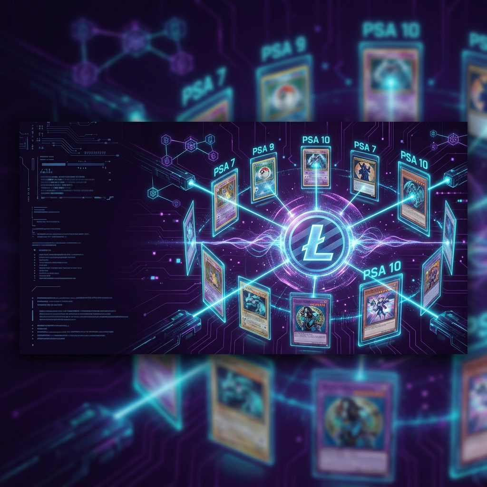
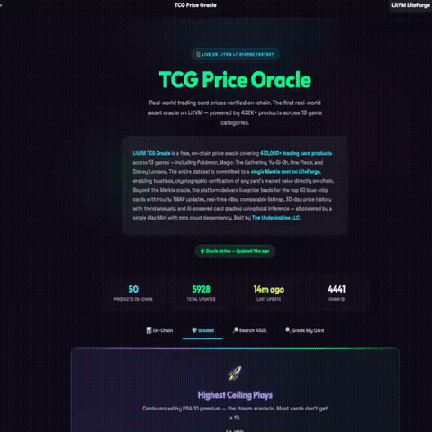

<div align="center">



# ⚡ LitVM TCG Oracle

**On-Chain Price Oracle & AI Card Grader for 432,000+ Trading Cards**

Built on [LitVM LiteForge](https://litvm.com/) — Litecoin's EVM-Compatible Layer 2

[](https://github.com/sailorpepe/litvm-tcg-oracle/stargazers)
[](LICENSE)
[-00dcff.svg)](https://liteforge.explorer.caldera.xyz)
[](https://www.the-undesirables.com/litvm)
[](#-data-pipeline)
[](#-testing)

[Live App](https://www.the-undesirables.com/litvm) · [Block Explorer](https://liteforge.explorer.caldera.xyz) · [API Docs](https://www.the-undesirables.com/docs)

</div>

<div align="center">



*Live demo — [try it yourself →](https://www.the-undesirables.com/litvm)*

</div>

---

## 📑 Table of Contents

- [Overview](#-overview)
- [Supported Games](#-supported-games)
- [Architecture](#️-architecture)
- [Smart Contracts](#-smart-contracts)
- [REST API](#-rest-api)
- [AI Grading Methodology](#-ai-grading-methodology)
- [Tech Stack](#️-tech-stack)
- [Project Structure](#-project-structure)
- [Testing](#-testing)
- [Quick Start](#-quick-start)
- [Links](#-links)
- [Stats](#-stats)
- [License & Commercial Use](#-license--commercial-use)

---

## 🔮 Overview

A trustless price oracle for the $50B+ trading card market — verifying 432,000+ product prices on-chain using Merkle proofs, with live price feeds for the top 50 blue-chip cards and AI-powered card grading.

| Feature | Description |
|---------|-------------|
| **📊 Merkle Price Oracle** | 432K products verified via a single on-chain Merkle root. Anyone can prove any price. |
| **💎 Graded 100** | Top 100 graded cards ranked by PSA premium — switchable by grade (PSA 10–5) |
| **⚡ Live Price Feed (V2)** | Top 50 blue-chip products updated hourly with 24-period TWAP ring buffer |
| **🔍 AI Card Grader** | Upload a card photo → get PSA-style grade in ~60 seconds via Qwen 2.5 VL 7B |
| **🔎 eBay Comps** | Real-time active eBay listings via Browse API for price comparison |
| **🌐 Free REST API** | Search, history, eBay comps — free for any app or agent to consume |
| **🤖 Zero Cloud** | Runs on a Mac Mini. No AWS, no OpenAI. Local AI inference via Ollama. |

---

## 📊 Supported Games

| Category | Category ID | Products | Source |
|----------|-------------|----------|--------|
| ⚡ Pokémon | 3 | 100K+ | TCGPlayer via TCGCSV |
| 🧙 Magic: The Gathering | 1 | 120K+ | TCGPlayer via TCGCSV |
| 🐉 Yu-Gi-Oh! | 2 | 80K+ | TCGPlayer via TCGCSV |
| 🏴‍☠️ One Piece | 64 | 15K+ | TCGPlayer via TCGCSV |
| ✨ Disney Lorcana | 71 | 5K+ | TCGPlayer via TCGCSV |
| ⚔️ Flesh & Blood | 63 | 10K+ | TCGPlayer via TCGCSV |
| 🦎 Digimon | 62 | 8K+ | TCGPlayer via TCGCSV |
| ⭐ Star Wars Unlimited | 82 | 3K+ | TCGPlayer via TCGCSV |
| 🔥 Dragon Ball | 56 | 5K+ | TCGPlayer via TCGCSV |
| + 4 more | — | — | TCGPlayer via TCGCSV |

**Total: 432,000+ products · 12.7M price rows · 30 days of daily snapshots**

---

## 🏗️ Architecture

```
                           ┌──────────────────────────────────┐
                           │        LitVM LiteForge           │
                           │       Chain ID: 4441             │
                           │                                  │
                           │  ┌────────────────────────────┐  │
                           │  │   MerklePriceOracle        │  │
                           │  │   432K products            │  │
      ┌──────────────┐     │  │   1 Merkle root / day      │  │
      │  TCGCSV API  │     │  └────────────────────────────┘  │
      │  (TCGPlayer)  │     │                                  │
      │  432K products │────▶│  ┌────────────────────────────┐  │
      └──────────────┘     │  │   TCGPriceOracleV2         │  │
             │             │  │   50 blue-chips             │  │
             ▼             │  │   Hourly updates + TWAP     │  │
      ┌──────────────┐     │  └────────────────────────────┘  │
      │  Mac Mini    │────▶│                                  │
      │  SQLite DB   │     └──────────────────────────────────┘
      │  12.7M rows  │
      │  FastAPI      │────▶  REST API (search, history, eBay)
      │  Ollama       │────▶  AI Card Grading (Qwen 2.5 VL 7B)
      └──────────────┘
             │
             ▼
      ┌──────────────┐     ┌──────────────────┐
      │  eBay Browse  │     │  Next.js App     │
      │  API (comps)  │     │  (Vercel)        │
      └──────────────┘     │  the-undesirables │
                           │  .com/litvm       │
                           └──────────────────┘
```

---

## 📜 Smart Contracts

> Deployed on **LitVM LiteForge Testnet** (Chain ID `4441`)

| Contract | Address | Purpose | Gas Cost |
|----------|---------|---------|----------|
| **MerklePriceOracle** | [`0x96B1...70Cd`](https://liteforge.explorer.caldera.xyz/address/0x96B124f50156589274ADF8F674509374752170Cd) | Merkle root for 432K prices | ~162K (1 tx/day) |
| **GradedPriceOracle** | [`0xc159...636B`](https://liteforge.explorer.caldera.xyz/address/0xc159550e9e751d6E75A0A06Bb04cfA2f59aD636B) | Graded prices Merkle root (PSA 10–5) | ~101K (1 tx/day) |
| **TCGPriceOracleV2** | [`0x04a1...3072`](https://liteforge.explorer.caldera.xyz/address/0x04a128F4a7A0588D259F8abe9E260BbffF203072) | Live price feed + TWAP | ~450K (1 tx/hour) |
| **TCGPriceOracle (V1)** | [`0xA79C...5771`](https://liteforge.explorer.caldera.xyz/address/0xA79C6b3922949fcaBb518f56f0B6e68Ca7115771) | Original oracle (retired) | — |
| **GradingEscrow** | [`0xe784...bB82`](https://liteforge.explorer.caldera.xyz/address/0xe784d2AE4171De8f909eb638a60BE03B2341bB82) | Grading payment (0.001 zkLTC) | — |
| **TCGOracleToken** | [`0x8D0A...9AD4`](https://liteforge.explorer.caldera.xyz/address/0x8D0AF701d318Be518F9ca6934B8F76Be24029AD4) | TCGO governance token (1M supply) | — |

### MerklePriceOracle — How It Works

The core innovation: instead of writing 432K prices on-chain (impossible gas cost), we build a Merkle tree off-chain and push only the **32-byte root** on-chain. Anyone can verify any individual price by requesting a proof from the API.

```
Leaf encoding (double-hash, OpenZeppelin standard):
  keccak256(bytes.concat(keccak256(abi.encode(productId, categoryId, name, marketPrice, lowPrice))))
```

**Verification flow:**
1. User queries the API for a card's price + Merkle proof
2. User submits the proof to `verifyPrice()` on-chain
3. Contract verifies the proof against the current root
4. Returns `true` if the price is authentic

**Security features:**
- `Ownable2Step` — prevents accidental ownership transfer
- `Pausable` — emergency kill switch
- 48-hour staleness threshold — data must be fresh
- Full root history for audit trail
- Double-hash leaf encoding prevents second-preimage attacks

### TCGPriceOracleV2 — Live Feed

Tracks 50 blue-chip products with hourly on-chain updates:

- Batch update in a single transaction (V1 used 5 separate txs)
- 24-period TWAP ring buffer for time-weighted average prices
- All prices in cents (USD × 100) for integer precision
- Events emitted for every update (off-chain indexers)

---

## 🌐 REST API

All endpoints are free and public. The oracle server runs on a Mac Mini behind a Cloudflare tunnel.

| Endpoint | Method | Description |
|----------|--------|-------------|
| `/api/v1/search?query=charizard&game=Pokemon&limit=20` | GET | Search 432K products with game filtering |
| `/api/v1/history?product_id=197780` | GET | 30-day price history + stats + snapshot |
| `/api/v1/ebay-comps?query=Charizard+Base+Set&limit=8` | GET | Active eBay listings for price comparison |
| `/api/v1/market?game=Pokemon&limit=10` | GET | Top cards by market price per game |

### Search Response Example

```json
{
  "status": "ok",
  "data": {
    "results": [
      {
        "product_id": 197780,
        "name": "Charizard GX",
        "clean_name": "Charizard GX",
        "category_id": 3,
        "marketPrice": 641.54,
        "lowPrice": 566.50,
        "midPrice": 623.99
      }
    ],
    "total": 20,
    "game_filter": "Pokemon"
  }
}
```

### eBay Comps Response Example

```json
{
  "status": "ok",
  "source": "eBay Browse API",
  "note": "Active listings — not sold items",
  "data": {
    "listings": [
      {
        "title": "Charizard 4/102 Base Set Holo Rare",
        "price": 79.32,
        "currency": "USD",
        "condition": "Ungraded",
        "imageUrl": "https://i.ebayimg.com/...",
        "itemUrl": "https://www.ebay.com/itm/..."
      }
    ],
    "total": 8,
    "median_price": 74.70,
    "low": 42.26,
    "high": 79.32
  }
}
```

---

## 🔍 AI Grading Methodology

The grader follows **PSA/Beckett standards** using Qwen 2.5 VL 7B (local inference via Ollama):

```
┌─────────────┬──────────────────────────────────────────┐
│  CENTERING  │  Border ratio analysis (55/45 = PSA 10)  │
├─────────────┼──────────────────────────────────────────┤
│  CORNERS    │  Wear, whitening, rounding detection      │
├─────────────┼──────────────────────────────────────────┤
│  EDGES      │  Chipping, whitening, rough cut analysis  │
├─────────────┼──────────────────────────────────────────┤
│  SURFACE    │  Scratches, print defects, crease scan    │
└─────────────┴──────────────────────────────────────────┘
```

- Final grade is **capped by the lowest sub-score** (weakest link rule)
- Most cards grade **5–8** — a 10 is virtually impossible
- Conservative by design — matches real-world PSA expectations
- Costs 0.001 zkLTC per grade (free testnet tokens from faucet)

---

## 🛠️ Tech Stack

```
Blockchain       LitVM LiteForge (Litecoin L2, Chain ID 4441)
Smart Contracts  Solidity ^0.8.28 (OpenZeppelin 5.x — Ownable2Step, Pausable, MerkleProof)
AI Model         Qwen 2.5 VL 7B via Ollama (local inference, zero cloud)
Price Data       TCGPlayer market data via TCGCSV (432K products, daily refresh)
eBay Comps       eBay Browse API (OAuth2 Client Credentials)
Database         SQLite (12.7M rows, 2 indexes, ~1.2GB)
Backend          FastAPI + uvicorn (Python 3.10+)
Frontend         Next.js 15 + RainbowKit + wagmi + ethers.js
Image Pipeline   Pillow + pillow-heif (HEIC/WebP/PNG → JPEG)
Testing          Hardhat + Chai (31 MerklePriceOracle tests + V2 tests)
Hosting          Mac Mini (M-series, 16GB) via Cloudflare tunnel
```

---

## 📁 Project Structure

```
litvm-tcg-oracle/
├── assets/
│   └── banner.png
├── contracts/
│   ├── MerklePriceOracle.sol       # Merkle root oracle — verifies 432K prices
│   ├── GradedPriceOracle.sol       # Graded prices Merkle oracle — PSA 10–5
│   ├── TCGPriceOracleV2.sol        # Live feed — top 50 with TWAP ring buffer
│   └── TCGPriceOracle.sol          # V1 oracle (retired, kept for reference)
├── scripts/
│   ├── merkle_builder.py           # Builds Merkle tree from SQLite → pushes root on-chain
│   ├── merkle_deploy.py            # Deploys MerklePriceOracle contract
│   ├── deploy_v2.py                # Deploys TCGPriceOracleV2 contract
│   ├── litvm_updater_v2.py         # Hourly cron — pushes top 50 prices to V2
│   └── litvm_grader.py             # AI grading worker (Qwen 2.5 VL → PSA score)
├── test/
│   ├── MerklePriceOracle.test.js   # 31 unit tests for Merkle verification
│   └── TCGPriceOracleV2.test.js    # V2 batch update, TWAP, pause tests
├── airdrop-to-mac-mini/
│   ├── MerklePriceOracle_abi.json  # Compiled ABI for Mac Mini deployment
│   ├── MerklePriceOracle_bytecode.txt
│   └── merkle_deploy.py            # Standalone deployer for Mac Mini
├── artifacts/                      # Hardhat compilation output
├── hardhat.config.js               # LiteForge network config (Chain 4441)
├── package.json
├── .env.example
├── .gitignore
└── LICENSE                         # Business Source License 1.1
```

---

## 🧪 Testing

```bash
# Install dependencies
npm install

# Run Hardhat tests (no network needed — uses local Hardhat EVM)
npx hardhat test
```

**MerklePriceOracle tests** (31 cases):
- Root update, staleness check, history tracking
- Merkle proof verification (valid/invalid/tampered)
- Pause/unpause, ownership transfer (Ownable2Step)
- `computeLeaf()` matches Solidity encoding
- `verifyAndRecord()` emits events

**TCGPriceOracleV2 tests**:
- Batch price updates, TWAP ring buffer
- Gas optimization, batch size limits
- Category filtering, product lookups

---

## ⚡ Quick Start

This is a live product — no setup required to use it.

👉 **[Launch the app →](https://www.the-undesirables.com/litvm)**

Browse 432K cards, compare eBay prices, grade a card for 0.001 zkLTC (free testnet tokens).

### For Developers

```bash
# Clone and install
git clone https://github.com/sailorpepe/litvm-tcg-oracle.git
cd litvm-tcg-oracle
npm install

# Copy environment variables
cp .env.example .env
# Add your deployer private key to .env

# Compile contracts
npx hardhat compile

# Run tests
npx hardhat test

# Deploy to LiteForge
npx hardhat run scripts/deploy_v2.py --network liteforge
```

---

## 🔗 Links

| Resource | URL |
|----------|-----|
| **Live App** | [the-undesirables.com/litvm](https://www.the-undesirables.com/litvm) |
| **Block Explorer** | [liteforge.explorer.caldera.xyz](https://liteforge.explorer.caldera.xyz) |
| **Faucet** | [liteforge.hub.caldera.xyz](https://liteforge.hub.caldera.xyz) |
| **LitVM** | [litvm.com](https://litvm.com) |
| **MCP Server** | [pypi.org/project/undesirables-mcp-server](https://pypi.org/project/undesirables-mcp-server/) |
| **npm Plugin** | [npmjs.com/package/plugin-undesirables](https://www.npmjs.com/package/plugin-undesirables) |

---

## 📊 Stats

| Metric | Value |
|--------|-------|
| Products tracked | **432,000+** across 13 game categories |
| Price data rows | **12.7 million** (30 days of daily snapshots) |
| On-chain updates | Merkle root daily + Graded root daily + V2 hourly |
| Search latency | **~50ms** across 432K products |
| AI grading time | **~60 seconds** per card |
| Infrastructure | 1 Mac Mini (M-series, 16GB) + Cloudflare tunnel |
| Cloud dependency | **Zero** — no AWS, no GCP, no OpenAI |

---

<div align="center">

**Built by [THE UNDESIRABLES LLC](https://www.the-undesirables.com)** · sailorpepe.eth

*432,000 prices. One Merkle root. Zero cloud.*

</div>

## 📝 License & Commercial Use

This project is licensed under the **[Business Source License 1.1 (BUSL-1.1)](LICENSE)**.

We build in public and support the developer ecosystem — but we also protect the infrastructure and IP of **The Undesirables LLC**.

### ✅ What You CAN Do (Free)

- **Personal & Educational Use** — Download, modify, and run locally for learning, research, or personal projects.
- **Non-Competing Applications** — Integrate our packages into your app, provided your app does not offer TCG market intelligence, pricing aggregation, AI card grading, or on-chain price oracle services as its primary function.
- **MCP / Agent Integration** — Connect your AI agent to our tools for non-commercial use.
- **Community Contributions** — Security audits, bug fixes, and PRs are always welcome.

### 🚫 What You CANNOT Do (Use Limitation)

- **Competing Service** — You may not use this code to operate a competing TCG market intelligence, pricing aggregation, AI card grading, or on-chain price oracle service.
- **Commercial Resale** — You may not wrap our API, data pipelines, or AI models into a paid service without a commercial license.
- **Hosted SaaS** — You may not host this software as a service for third parties without written permission.

### 🔓 Open-Source Conversion

On **June 1, 2030** (or 4 years after the first public release of each version), this code automatically converts to the **MIT License** — fully open source, forever.

### 🤝 Commercial Licensing

Building a commercial product? Want guaranteed API access or white-label integration? Contact us:

📧 **theundesirables7@gmail.com** · 🐦 **[@undesirables_ai](https://x.com/undesirables_ai)**

© 2026 The Undesirables LLC

---

<div align="center">

⭐ **If this project helped you, please star this repo** — it helps others find it.

[Report Bug](../../issues) · [Request Feature](../../issues)

</div>
